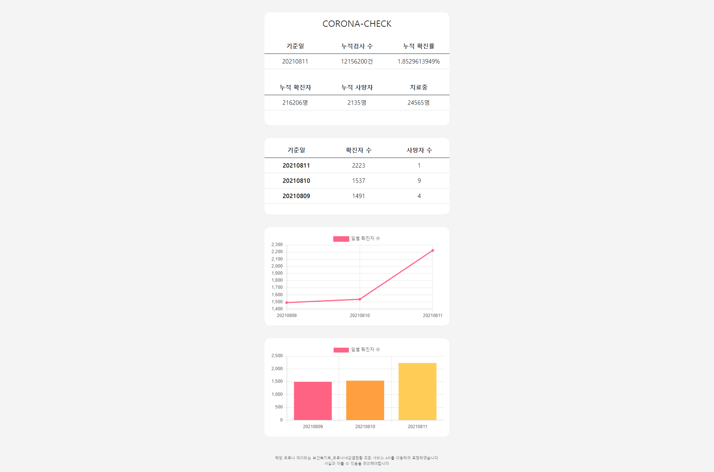

# CORONA-CHECK 

- 타입스크립트 개념 공부 후 응용 목적인 간단한 웹사이트
- 보건복지부_코로나19감염현황 조회 서비스 API를 이용하여 데이터를 표현
- Chart.js, typescript, eslint 숙련도 향상을 목표

 

## 시연 방법

1. back 폴더 터미널 접근
2. npm run dev 입력 ( 코로나 API 요청 후 받아오는 API 서버 )
3. index.html 파일 live server로 실행 

 

## 자세한 후기

[Typescript를 이용한 코로나 현황](https://velog.io/@qwe6293/Typescript%EB%A5%BC-%EC%9D%B4%EC%9A%A9%ED%95%9C-%EC%BD%94%EB%A1%9C%EB%82%98-%ED%98%84%ED%99%A9)

 
## 페이지 화면

